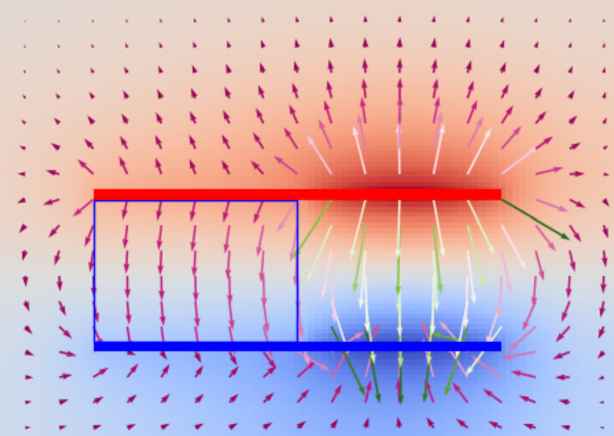
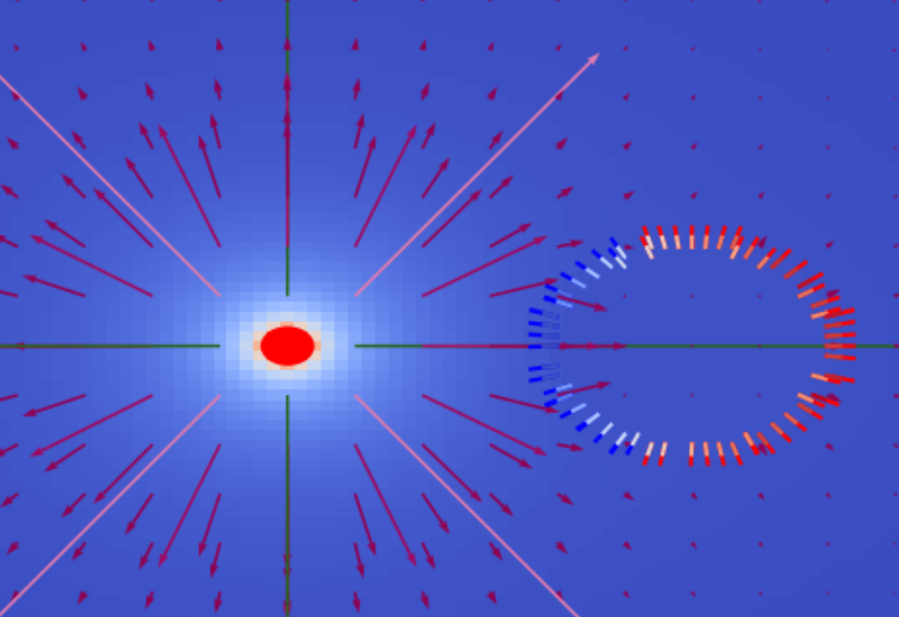
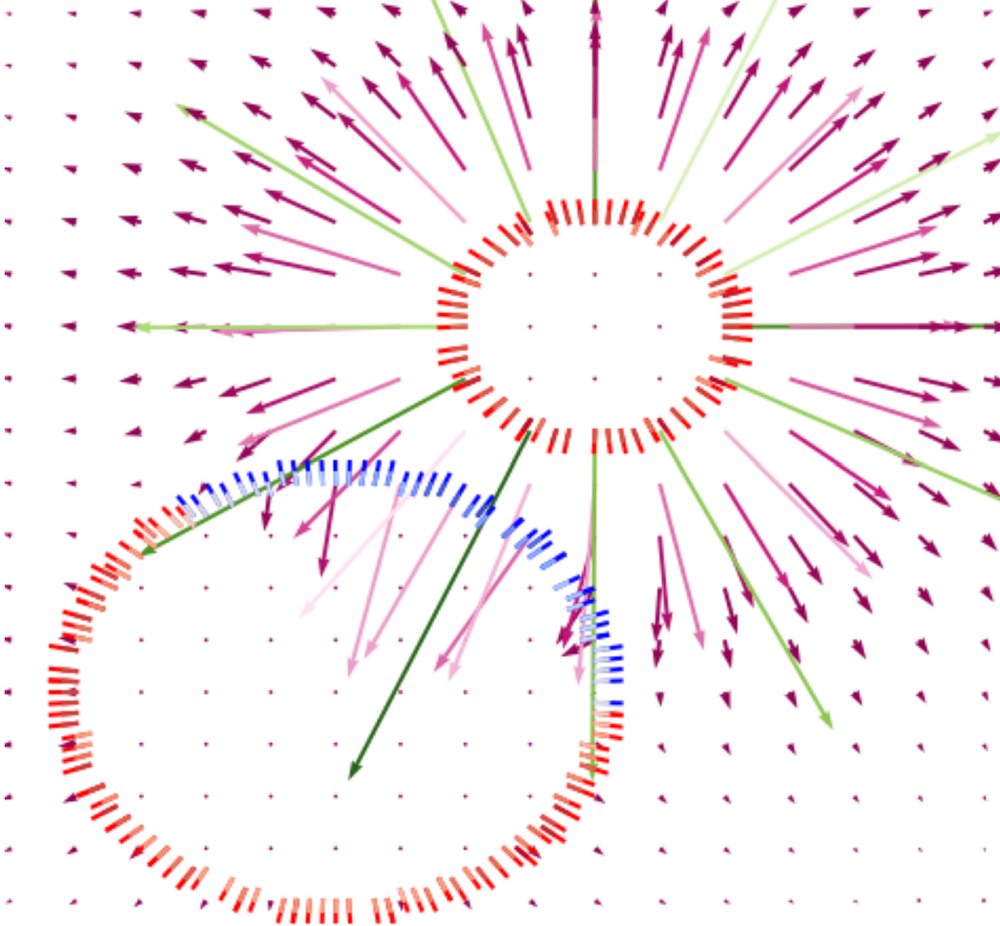
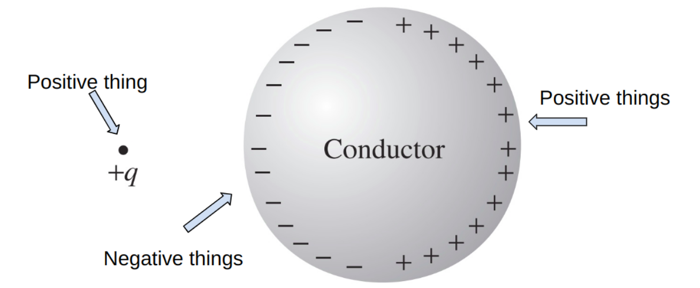

# Electrostatics Solver (2024)

Solves for voltage and electric field, given any configuration of conductors, fixed charges, and dielectric materials. It utilizes the **Finite Difference Method** and **Successive Over-Relaxation** to solve the electrostatic Partial Differential Equation.

## Examples

*A parallel plate capacitor half filled with a linear dielectric medium.*

*A frozen-in charge (left) induces charge on the conductor (right).*

*A very positively charged conductor (top right) induces charge on a slightly negative conductor (bottom left).*

## What is Electrostatics?

Electrostatics refers to situations where nothing is moving. It focuses on the electrical charge of materials when nothing is moving.

## What is Being Solved For?

As you might know, positive (protons) and negative (electrons) things attract. Two positive or two negative charges repel each other. This whole process happens through the electric field, a.k.a. the arrows, which protons and electrons create. When a conductor goes near something positively charged, the electrons run towards the positive charge while the protons run away from the positive charge (since they repel). This creates an equilibrium. This equilibrium is what is being solved for.

*Credit: Introduction to Electrodynamics by David Griffiths*

## The Math

The problem can be written in terms of a PDE where I solve for **V** in this equation:

$$
\nabla \cdot [\epsilon(\vec{r})] = - \dfrac{\rho(\vec{r})}{\epsilon_0}
$$

Which is derived from Maxwell's Equations in Matter, namely **Gauss's Law**:

$$
\nabla \cdot \vec{D} = \rho(\vec{r})
$$

and converting **V** to **E** via:

$$
\vec{E} = -\nabla V
$$

The solver takes advantage of the fact that electric potential is constant in a conductor at equilibrium.

I must solve voltage separately for each conductor and then calculate the correct linear combination of voltage fields to get the correct net charge.

# How to use
Open the folder in cmd and type `pip install -r requirements.txt`

Open `main.py`. It will include instructions on how to add your own charges to the simulation.

Run `main.py` with the command: `python main.py`